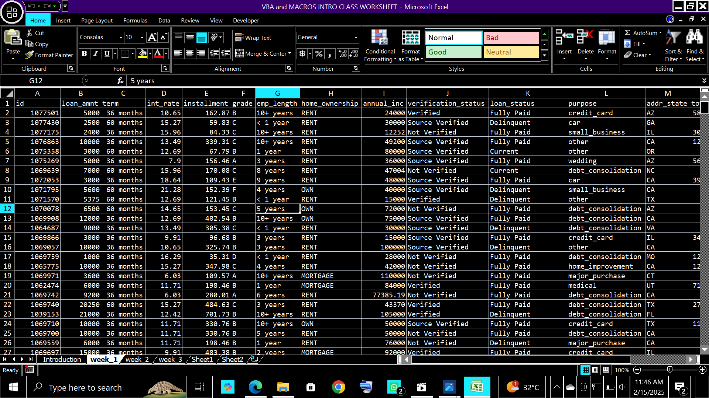
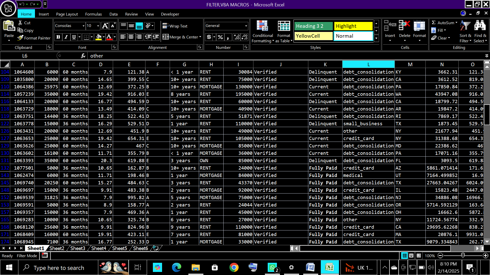

HOME-OWNERSHIP-ANALYSIS

INTRODUCTION

This is an analysis showing  the fully paid,the delinquent and the current debtors in a mortgage.

It also shows those whose payment are verified and unverified.

PROBLEM STATEMENT

-To easily differentiate fully paid individuals from the delinquent and current.

-Also to easily determine those whose payments are verified by making them to appear in the same roll after the the unverified.

DATA SOURCE

This data was gotten from my instructor who teaches  in Dahel techies.

Here the microsoft excel was ,used to sort out the verified from  the unverified and the fully paid from the delinquent and current.

DATA ANALYSIS

    RAW DATA                     

 ANALYSED DATA
 
 
From both datas above,it can be seen that the raw data showed a list of fully payed and the verifed being scattered in differnt rolls,but after my analysis,it all came together for easy access in their different rolls and columns.

 RECOMMENDATION
 
 -From  my analysis,it can be seen that those who has completed their payment are in greater number compared to those who have not.
 
 -Also the time frame it took majority of them to finish their payment is between one to ten years,therefore i recommend that those still owing who have not  reach the maximum years of most of the fully paid   should also be given more time to complete their payment.
 
 -Also,i filtered those whose payment were not verified and source verified leaving only the verified in the verification status for easy documentation.

 -I also gathered from the analysis that the fully paid are mostly those under mortgage and rent,therefore it is advisable to continue rentage and mortgage because the percentage of compliers are higher and will help to generate more income for  the company.
 
 
                       

